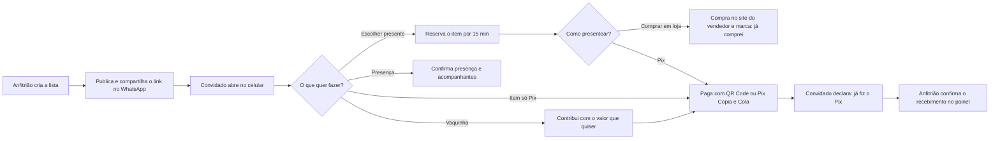
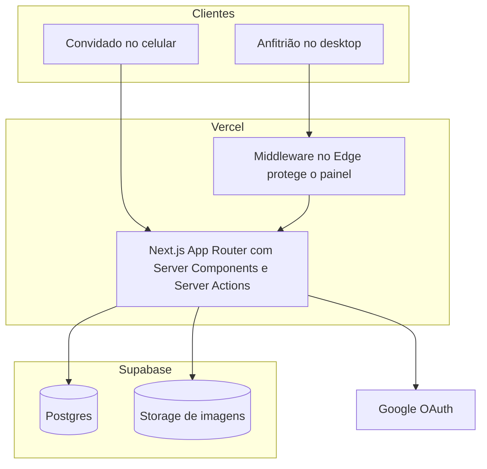
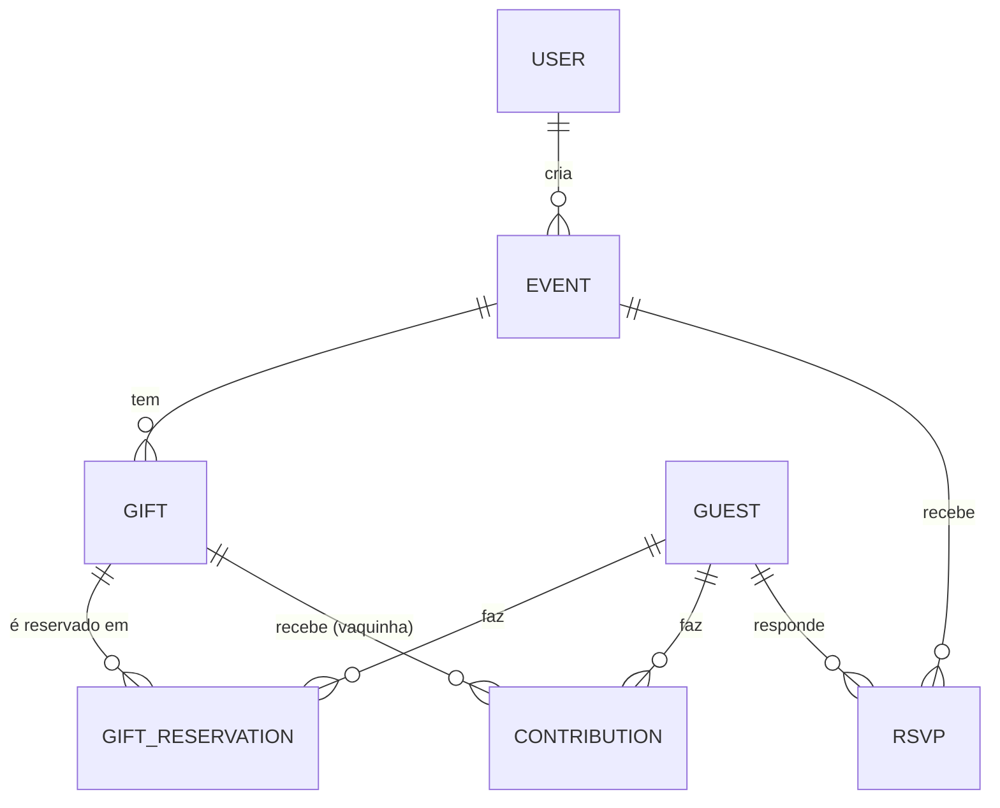

<div align="center">

# 🎁 Momoslist

**A lista de presentes do seu chá de panela ou casa nova, num link só.**
Sem planilha, sem presente repetido e sem o convidado precisar criar conta.


[O que é](#-o-que-é) · [Por que existe](#-por-que-existe) · [Como funciona](#-como-funciona) · [Recursos](#-recursos) · [Rodar localmente](#-rodando-localmente) · [Deploy](#-deploy-na-vercel)

</div>

---

## ✨ O que é

O **Momoslist** é uma plataforma web para montar **listas de presentes de chá de panela e chá de casa nova**.

- **O anfitrião** (quem vai receber) cria a lista, escolhe a cor e a capa, publica e acompanha tudo num painel.
- **O convidado** abre o link pelo WhatsApp, no celular, escolhe um presente ou contribui numa vaquinha, paga por **Pix** ou compra na loja, e confirma presença. **Sem cadastro com senha e sem instalar nada.**

> O dinheiro **não passa pela plataforma**: o Pix vai direto do convidado para o anfitrião.

## 🎯 Por que existe

Listas em grupo de WhatsApp e planilhas compartilhadas funcionam até o segundo convidado escolher o mesmo jogo de panelas.

| Sem o Momoslist | Com o Momoslist |
|---|---|
| Duas pessoas compram o mesmo presente | Cada item é **reservado** no banco: a última unidade só vai para uma pessoa, mesmo com cliques simultâneos |
| "Já fiz o Pix" perdido numa conversa | O convidado declara o Pix e o anfitrião **confirma o recebimento** num painel |
| Vaquinha controlada no papel | **Meta, valor mínimo e barra de progresso** em tempo real |
| Convidado sem saber onde comprar ou pagar | Link da loja **ou** QR Code e Pix Copia e Cola já com o valor certo |
| Contagem de quem vai ao evento feita na mão | **Confirmação de presença** com acompanhantes, adultos e crianças, e exportação em CSV |
| Página genérica e sem identidade | Página pública **com a cor e a capa do evento**, pensada para o celular |

**Quem ganha o quê**

- 💚 **Anfitrião:** controle total, nenhum presente repetido, visão clara do que já chegou e do que falta confirmar.
- 📱 **Convidado:** abre o link, escolhe e paga em poucos toques, sem criar senha.
- 🔒 **Ambos:** privacidade. A lista só é acessível por quem tem o link, e os convidados não veem os dados uns dos outros.

## 🧭 Como funciona



### Os três tipos de item

| | 🎁 **Presente** | ⚡ **Pix** | 🐷 **Vaquinha** |
|---|---|---|---|
| **Para quê** | Um item que já tem onde comprar | Algo que vocês querem comprar, mas **ainda não escolheram a loja** | Um objetivo maior, como lua de mel ou reforma |
| **Link de loja** | Opcional | Não tem | Não tem |
| **Como o convidado paga** | Loja **ou** Pix | **Só Pix** | **Só Pix**, com o valor que quiser (a partir do mínimo) |
| **Quantidade** | Sim | Sim | Não (é uma única vaquinha) |
| **Sinalização para o convidado** | Sem selo | Selo **Pix** | Selo **Vaquinha** e barra de progresso |
| **Pode mudar de tipo depois?** | ✅ Para Pix | ✅ Para Presente | ❌ Continua vaquinha |

## 🧩 Recursos

### 👩‍🍳 Para o anfitrião (painel, feito para desktop e responsivo)

- **Conta** por e-mail e senha ou **login com Google**; as duas se unem quando o e-mail é o mesmo.
- **Lista completa:** tipo de evento, data e horário, local com link do mapa, endereço de entrega e uma mensagem que preserva parágrafos.
- **Aparência própria:** capa, foto de perfil e **cor de destaque** por lista. A paleta é derivada da cor escolhida com **contraste de acessibilidade (WCAG AA)** garantido.
- **Painel em quatro abas:**
  - **Resumo:** total arrecadado, reservados, disponíveis, Pix pendentes, vaquinhas em linhas compactas e últimas reservas.
  - **Presentes:** cadastro, edição e exclusão, com **ordenação** por ordem de cadastro, mais recentes, nome (A–Z e Z–A), menor e maior valor, e tipo de item.
  - **Confirmações:** liga e desliga o RSVP, totais de pessoas, adultos, crianças e recusas, lista de respostas e **exportação em CSV**.
  - **Configurações:** dados do evento e aparência da lista na mesma tela.
- **Visualizar como convidado:** prévia que só o dono acessa, com os botões desativados, para nunca gerar reservas de teste.
- **Confirmação manual do Pix** e das contribuições de vaquinha, com opção de recusar.
- **Publicar e despublicar** a lista quando quiser.

### 📱 Para o convidado (página pública, feita para o celular)

- **Um link**, sem cadastro com senha. Ao escolher algo, informa só nome, e-mail e telefone.
- **Vitrine** de 2 colunas no celular, com foto inteira (sem recortes), **busca e ordenação** que ficam na URL (dá para compartilhar o link já filtrado).
- **Sinalização clara:** itens só-Pix e vaquinhas têm selo próprio na foto, então o convidado sabe de antemão como vai presentear.
- **Reserva com prazo** e possibilidade de **desistir a qualquer momento**, inclusive depois de confirmar.
- **Pix com QR Code e Copia e Cola** gerados na hora, com o valor exato.
- **Vaquinha** com progresso, quanto falta e contribuição a partir do mínimo.
- **Confirmação de presença:** vai ou não vai, com quantos acompanhantes, adultos e crianças.
- **Endereço de entrega copiável** para quem prefere enviar o presente.

## 📏 Regras de negócio importantes

| Tema | Regra |
|---|---|
| **Acesso à lista** | A URL exige **slug e token seguro** juntos, e a lista precisa estar publicada; caso contrário, 404. Listas não são indexadas por buscadores (`noindex`), mas geram prévia no WhatsApp. |
| **Concorrência** | A reserva roda em uma transação com isolamento **Serializable**: se dois convidados pegam a última unidade ao mesmo tempo, o banco aceita só uma. |
| **Reserva temporária** | Expira após `RESERVATION_TIMEOUT_MINUTES` (padrão 15). A expiração é tratada sob demanda, a cada carregamento e a cada nova tentativa de reserva. |
| **Desistência** | O convidado pode cancelar antes ou depois de confirmar; a unidade volta para a lista. Se já declarou um Pix, é avisado de que **não há estorno automático**. |
| **Item do tipo Pix** | Não tem link de loja: o método de pagamento é escolhido sozinho (Pix) ao reservar, e o servidor recusa "compra em loja" nesse tipo. O valor cadastrado é o valor do Pix gerado. |
| **Chave Pix** | Só é entregue a quem tem reserva ativa com método Pix; nunca aparece na página pública antes disso. |
| **Dinheiro** | Sempre em **centavos inteiros** (nunca `float`). Nenhum pagamento passa pela plataforma: o Pix vai direto para o anfitrião. |
| **Pix Copia e Cola** | Payload EMV / BR Code do BACEN gerado localmente em [`lib/pix-payload.ts`](src/lib/pix-payload.ts). |
| **Vaquinha** | Valor mínimo por pessoa; a meta pode ser ultrapassada (o excedente aparece à parte). O total arrecadado soma o **confirmado** e o **aguardando confirmação**, e a barra mostra os dois trechos separados. O anfitrião pode confirmar ou recusar cada contribuição. |
| **Identidade do convidado** | Nome + e-mail + telefone, sem senha. Um cookie `httpOnly` lembra a pessoa por 180 dias. Se o e-mail já existe com outro telefone, o cadastro é recusado. |
| **Confirmação de presença** | Uma resposta por convidado (pode ser alterada). Conta como 1 adulto + acompanhantes. Só funciona se a lista estiver publicada e o RSVP ligado. |
| **Prévia do anfitrião** | Somente o dono acessa; a página fica `inert`, para que nunca gere reserva de teste. |
| **Ordem dos itens** | A ordenação do painel é só uma visão do anfitrião. Os convidados veem os itens na ordem de cadastro. |

## 🏗️ Arquitetura e decisões técnicas



- **Next.js App Router com Server Components.** As páginas buscam os dados no servidor; a interatividade fica em componentes cliente pequenos.
- **Server Actions** para todas as mutações (`src/actions`). Cada action **revalida a entrada com Zod no servidor** e confere se o usuário é dono do recurso. A validação do cliente é só conforto.
- **Autenticação em duas camadas.** `lib/auth.config.ts` é a configuração leve (sem Prisma nem bcrypt), usada no **middleware** que protege `/dashboard/*` no Edge. `lib/auth.ts` é a configuração completa (Prisma, Google, senha). Sessão em **JWT**.
- **Anfitrião e convidado são entidades diferentes.** O anfitrião é um `User` com Auth.js. O convidado é um `Guest` leve (sem senha), o que tira atrito de quem só quer presentear.
- **Imagens.** Vão para o **Supabase Storage** (bucket público `gift-images`) pelo servidor, com a chave de serviço. Antes de enviar, o navegador **reduz a foto** (`lib/shrink-image.ts`), porque a Vercel recusa requisições acima de ~4,5 MB.
- **Identidade visual.** Base neutra e fixa, com uma **cor de destaque por lista** aplicada via variáveis CSS (`--primary*`). Tipografia: Inter para a interface e Fraunces (serifada) só em títulos de destaque. Componentes no estilo shadcn/ui sobre Radix.
- **Acessibilidade.** Contraste garantido nas cores derivadas, foco visível, atalho "Pular para o conteúdo", diálogos com `role="alertdialog"` para ações destrutivas, `aria-label` em botões de ícone e respeito a `prefers-reduced-motion`.
- **Erros e logs.** `error.tsx` global e um logger estruturado: o detalhe técnico vai para o log do servidor e o usuário vê uma mensagem clara.

---

## 🗄️ Modelo de dados

Definido em [`prisma/schema.prisma`](prisma/schema.prisma).



| Modelo | Papel |
|---|---|
| `User`, `Account`, `Session`, `VerificationToken` | Anfitriões e o vínculo com provedores (Auth.js). |
| `Event` | A lista: dados do evento, Pix, tema, `slug` + `secureToken`, `published`, `rsvpEnabled`. |
| `Gift` | Item da lista. `kind` = `PRODUCT` (presente), `PIX` (só Pix, sem loja) ou `FUND` (vaquinha, com meta e mínimo). |
| `Guest` | Convidado (nome, e-mail, telefone). E-mail único. |
| `GiftReservation` | Reserva de um produto: `status`, `paymentMethod` e `pixStatus`. |
| `Contribution` | Contribuição a uma vaquinha, em centavos, com status próprio. |
| `Rsvp` | Resposta de presença: uma por evento e convidado (`@@unique([eventId, guestId])`). |

Enums principais: `EventType`, `PixKeyType`, `ReservationStatus` (`TEMPORARY → CONFIRMED → COMPLETED`, ou `CANCELLED`/`EXPIRED`), `PaymentMethod`, `PixStatus` (`NOT_DECLARED → DECLARED → CONFIRMED`), `GiftKind` (`PRODUCT`, `PIX`, `FUND`), `ContributionStatus`, `RsvpStatus`.

---

## 📁 Estrutura de pastas

```
prisma/
  schema.prisma              modelo de dados
scripts/
  check-storage.mjs          diagnóstico do Supabase Storage
src/
  actions/                   Server Actions (auth, event, gift, reservation,
                             payment, contribution, guest, rsvp)
  schemas/                   validações Zod (uma por domínio)
  lib/                       regras e utilitários
    auth.ts / auth.config.ts   Auth.js (completo / leve para o Edge)
    pix-payload.ts             BR Code / Pix Copia e Cola
    theme.ts                   paleta por lista com contraste garantido
    fund.ts, rsvp.ts           cálculos de vaquinha e de presença
    gift-availability.ts       disponibilidade = quantidade − reservas ativas
    shrink-image.ts            redução de foto no navegador
    supabase-storage.ts        upload de imagens
  components/                componentes compartilhados (ui/ = base do design system)
  app/
    page.tsx                 landing
    login/, cadastro/        autenticação do anfitrião
    privacidade/             política de privacidade
    dashboard/               painel do anfitrião (protegido pelo middleware)
    lista/[eventSlugToken]/  página pública do convidado
    previa/[id]/             prévia do anfitrião (só o dono)
    api/auth/                rotas do Auth.js
  middleware.ts              protege /dashboard/*
```

---

## 🚀 Rodando localmente

**Pré-requisitos:** Node.js 20+ e um projeto no [Supabase](https://supabase.com) (Postgres e Storage).

```bash
# 1. Instalar dependências (o postinstall já roda `prisma generate`)
npm install

# 2. Criar o arquivo de ambiente e preencher (veja a seção abaixo)
cp .env.example .env

# 3. Criar as tabelas no banco
npm run db:push

# 4. Subir o projeto
npm run dev
```

Acesse `http://localhost:3000`.

Para conferir se o envio de imagens está configurado corretamente:

```bash
npm run check:storage
```

---

## 🔐 Variáveis de ambiente

Copie [`.env.example`](.env.example) para `.env`. O `.env` **nunca deve ir para o git** (já está no `.gitignore`).

| Variável | Obrigatória | Descrição |
|---|---|---|
| `DATABASE_URL` | sim | Conexão do Supabase pelo **pooler** (porta 6543) com `?pgbouncer=true&connection_limit=1`. É a usada em runtime. |
| `DIRECT_URL` | sim | Conexão direta (porta 5432). Usada só pelo Prisma CLI (`db push`, `migrate`). |
| `AUTH_SECRET` | sim | Segredo do Auth.js. Gere com `openssl rand -base64 32` (ou `node -e "console.log(require('crypto').randomBytes(32).toString('base64'))"`). Use um valor **diferente** em produção. |
| `AUTH_GOOGLE_ID` / `AUTH_GOOGLE_SECRET` | para login Google | Credenciais OAuth do Google Cloud. |
| `NEXT_PUBLIC_SUPABASE_URL` | sim | URL do projeto Supabase. |
| `NEXT_PUBLIC_SUPABASE_ANON_KEY` | sim | Chave pública (anon) do Supabase. |
| `SUPABASE_SERVICE_ROLE_KEY` | sim | Chave de serviço, **secreta**. Só é usada no servidor (upload de imagens). Nunca use o prefixo `NEXT_PUBLIC_`. |
| `NEXT_PUBLIC_SITE_URL` | sim | URL pública do site, sem barra final. Em produção é embutida no build: se mudar, faça novo deploy. |
| `NEXT_PUBLIC_CONTACT_EMAIL` | recomendada | E-mail exibido na Política de Privacidade para pedidos sobre dados pessoais. |
| `RESERVATION_TIMEOUT_MINUTES` | não | Validade da reserva temporária. Padrão: `15`. |

---

## 🔌 Configurando os serviços externos

### Supabase Storage (upload de imagens)

1. No painel do Supabase, vá em **Storage → New bucket**.
2. Crie um bucket chamado exatamente **`gift-images`** e marque como **Public**.
3. Em **Project Settings → API**, copie a **service_role key** para `SUPABASE_SERVICE_ROLE_KEY`.

### Login com Google

1. No [Google Cloud Console](https://console.cloud.google.com), crie um projeto e configure a **Tela de permissão OAuth** (tipo Externo). Escopos básicos: `email`, `profile`, `openid`.
2. Em **Credenciais**, crie um **ID do cliente OAuth** do tipo *Aplicativo da Web*.
3. Cadastre as **URIs de redirecionamento autorizadas**:
   - `http://localhost:3000/api/auth/callback/google`
   - `https://SEU-DOMINIO/api/auth/callback/google`
4. Copie o ID e o segredo para `AUTH_GOOGLE_ID` e `AUTH_GOOGLE_SECRET`.

Enquanto o app estiver em modo **Testando**, só entram os e-mails cadastrados como usuários de teste. Para liberar qualquer pessoa é preciso **publicar o app**, o que exige domínio próprio, página inicial e a política de privacidade em `/privacidade`.

---

## 🛠️ Scripts disponíveis

| Comando | O que faz |
|---|---|
| `npm run dev` | Servidor de desenvolvimento. |
| `npm run build` / `npm start` | Build e execução de produção. |
| `npm run lint` | ESLint. |
| `npm run db:push` | Aplica o schema no banco (sem gerar migrations). |
| `npm run db:migrate` | Cria e aplica uma migration (desenvolvimento). |
| `npm run db:studio` | Abre o Prisma Studio para inspecionar os dados. |
| `npm run check:storage` | Diagnostica o bucket do Supabase (variáveis, bucket, permissão pública e upload real). |

---

## ▲ Deploy na Vercel

1. Envie o código para o GitHub e importe o repositório na Vercel (Next.js é detectado automaticamente).
2. Cadastre as [variáveis de ambiente](#variáveis-de-ambiente) em **Settings → Environment Variables**. Use um `AUTH_SECRET` novo e `NEXT_PUBLIC_SITE_URL` com o domínio final.
3. Faça o deploy. O [`vercel.json`](vercel.json) fixa a região `gru1` (São Paulo), próxima ao banco, para reduzir a latência.
4. No Google Cloud, adicione a origem `https://SEU-DOMINIO` e a URI `https://SEU-DOMINIO/api/auth/callback/google`.

**Checklist pós-deploy:** login com senha → login com Google → criar lista → enviar foto pelo celular → abrir o link como convidado → reservar um presente → colar o link no WhatsApp para ver a prévia.

Detalhes que já estão tratados no projeto para a Vercel: o `postinstall` gera o Prisma Client; o middleware usa só a configuração leve do Auth.js (cabe no Edge); `trustHost` está ativo; e as fotos são reduzidas no navegador por causa do limite de 4,5 MB por requisição.

---

## 🛡️ Segurança e privacidade

- **Autorização em toda mutação.** Cada action confere que o recurso pertence ao usuário logado; o painel só consulta dados do dono.
- **Senhas** com hash bcrypt. A chave de serviço do Supabase nunca chega ao navegador.
- **Cookie de sessão** e cookie do convidado com `httpOnly` e `sameSite=lax` (e `secure` em produção).
- **Login com Google** só vincula a uma conta existente se o Google confirmar que o e-mail é verificado, e o seletor de contas é sempre exibido.
- **Privacidade (LGPD):** a política está em [`/privacidade`](src/app/privacidade/page.tsx). Convidados não veem dados uns dos outros; o anfitrião vê apenas quem interagiu com a própria lista.

> **Trade-off assumido:** o convidado não tem senha. Quem souber o e-mail **e** o telefone de outra pessoa pode se passar por ela e mexer na reserva dela. É aceitável para listas fechadas entre amigos. Para abrir ao público geral, o caminho é trocar a identificação por um link mágico enviado por e-mail — o modelo `Guest` continua o mesmo.

---

## 🧱 Limitações conhecidas e próximos passos

- **Confirmação de e-mail no cadastro** do anfitrião ainda não existe, nem redefinição de senha ("Esqueci minha senha").
- **Sem limite de tentativas** (rate limiting) no login.
- **Migrations versionadas:** o schema é aplicado com `db push`. Antes de operar com dados de clientes reais, migre para `prisma migrate`.
- **Mesmo banco em desenvolvimento e produção**, se ambos usarem o mesmo projeto do Supabase; o ideal é ter um projeto separado para cada.
- **Expiração de reservas** é tratada sob demanda. Um cron (Vercel Cron) para limpeza periódica seria apenas higiene.
- **Pix é declarativo:** a plataforma não consulta o banco, então o anfitrião confirma o recebimento manualmente.
- **Plano gratuito da Vercel (Hobby)** é só para uso não comercial.
