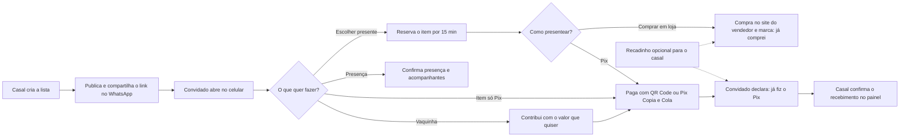
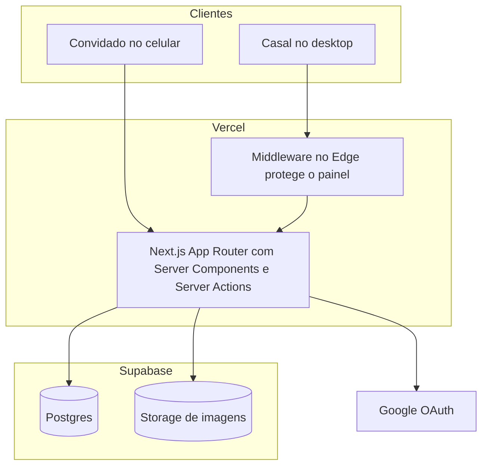
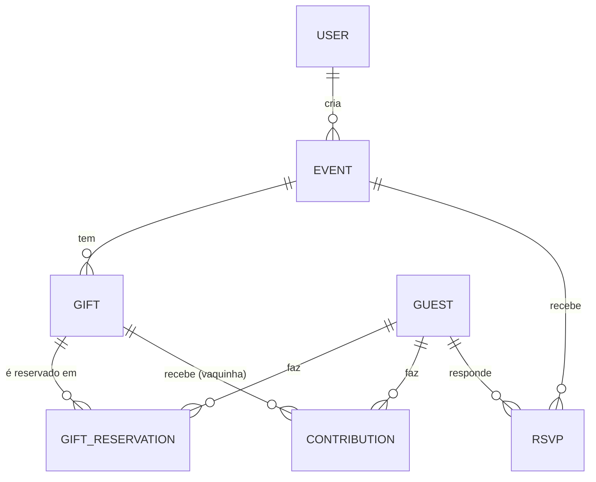

<div align="center">

# 🎁 Momoslist

**A lista de presentes do seu chá de panela ou casa nova, num link só.**
Sem planilha, sem presente repetido e sem o convidado precisar criar conta.


[O que é](#-o-que-é) · [Por que existe](#-por-que-existe) · [Como funciona](#-como-funciona) · [Recursos](#-recursos) · [Telas](#-um-passeio-pelas-telas) · [Rodar localmente](#-rodando-localmente) · [Deploy](#-deploy-na-vercel)

</div>

---

## ✨ O que é

O **Momoslist** é uma plataforma web para montar **listas de presentes de chá de panela e chá de casa nova**.

- **O casal** (quem vai receber) cria a lista, escolhe a cor e a capa, publica e acompanha tudo num painel.
- **O convidado** abre o link pelo WhatsApp, no celular, escolhe um presente ou contribui numa vaquinha, paga por **Pix** ou compra na loja, e confirma presença. **Sem cadastro com senha e sem instalar nada.**

> O dinheiro **não passa pela plataforma**: o Pix vai direto do convidado para o casal.

### Destaques

| | | |
|---|---|---|
| 🎁 **Presentes, Pix e Vaquinha**<br>Três tipos de item para cada situação, com loja, só Pix ou meta coletiva. | 💌 **Recadinhos**<br>O convidado deixa uma mensagem carinhosa ao presentear; o casal lê tudo numa aba própria. | 🙋 **Confirmação de presença**<br>Quem vai, com quantos acompanhantes, adultos e crianças, com totais e CSV. |
| ⚡ **Pix na hora**<br>QR Code e Pix Copia e Cola gerados com o valor exato, sem intermediário. | 🎨 **A cara do evento**<br>Capa, foto e cor de destaque por lista, com contraste de acessibilidade garantido. | 🔒 **Privado por link**<br>Só entra quem recebe o link; recados e dados dos convidados só o casal vê. |
| 📱 **Feito para o celular**<br>O convidado abre pelo WhatsApp e resolve em poucos toques. | 🧭 **Painel organizado**<br>Resumo, presentes, confirmações, recadinhos e configurações em abas. | 🚫 **Sem presente repetido**<br>Reservas protegidas no banco contra escolhas simultâneas. |

## 🎯 Por que existe

Listas em grupo de WhatsApp e planilhas compartilhadas funcionam até o segundo convidado escolher o mesmo jogo de panelas.

| Sem o Momoslist | Com o Momoslist |
|---|---|
| Duas pessoas compram o mesmo presente | Cada item é **reservado** no banco: a última unidade só vai para uma pessoa, mesmo com cliques simultâneos |
| "Já fiz o Pix" perdido numa conversa | O convidado declara o Pix e o casal **confirma o recebimento** num painel |
| Vaquinha controlada no papel | **Meta, valor mínimo e barra de progresso** em tempo real |
| Convidado sem saber onde comprar ou pagar | Link da loja **ou** QR Code e Pix Copia e Cola já com o valor certo |
| Mensagens carinhosas perdidas em conversas soltas | Cada convidado pode deixar um **recadinho** ao presentear, e o casal lê todos numa aba própria |
| Contagem de quem vai ao evento feita na mão | **Confirmação de presença** com acompanhantes, adultos e crianças, e exportação em CSV |
| Página genérica e sem identidade | Página pública **com a cor e a capa do evento**, pensada para o celular |

**Quem ganha o quê**

- 💚 **Casal:** controle total, nenhum presente repetido, visão clara do que já chegou e do que falta confirmar.
- 📱 **Convidado:** abre o link, escolhe e paga em poucos toques, sem criar senha.
- 🔒 **Ambos:** privacidade. A lista só é acessível por quem tem o link, e os convidados não veem os dados uns dos outros.

## 🧭 Como funciona



### Os três tipos de item

| | 🎁 **Presente** | ⚡ **Pix** | 🐷 **Vaquinha** |
|---|---|---|---|
| **Para quê** | Um item que já tem onde comprar | Algo que vocês querem comprar, mas **ainda não escolheram a loja** | Um objetivo maior, como lua de mel ou reforma |
| **Link de loja** | Opcional | Não tem | Não tem |
| **Como o convidado paga** | Loja **ou** Pix | **Só Pix** | **Só Pix**, com o valor que quiser (a partir do mínimo) |
| **Quantidade** | Sim | Sim | Não (é uma única vaquinha) |
| **Sinalização para o convidado** | Sem selo | Selo **Pix** | Selo **Vaquinha** e barra de progresso |
| **Pode mudar de tipo depois?** | ✅ Para Pix | ✅ Para Presente | ❌ Continua vaquinha |

### Jornada de quem presenteia

1. Abre o link recebido no WhatsApp e vê a **capa, o local, a data e a mensagem** do casal.
2. Navega pela vitrine (busca e ordenação ficam na URL) e toca em **Presentear** ou **Contribuir**.
3. Se apresenta uma única vez com nome, e-mail e telefone. Sem senha.
4. Escolhe **loja** ou **Pix**. Itens só-Pix e vaquinhas já seguem direto para o pagamento.
5. Paga com o **QR Code** ou o **Copia e Cola** e, se quiser, **deixa um recadinho**.
6. Toca em **Já fiz o Pix** (ou **Já comprei**). Pode **confirmar presença** e voltar depois para editar o recado ou desistir.

### Jornada de quem recebe

1. Cria a conta (e-mail e senha ou Google), cadastra o evento, o Pix e os itens.
2. Escolhe a **capa, a foto e a cor**, confere em **Visualizar como convidado** e **publica**.
3. Compartilha o link. No **Resumo** vê o que já foi escolhido e o que falta confirmar.
4. **Confirma os Pix** que chegaram, acompanha as **vaquinhas** e as **confirmações de presença**.
5. Lê os **recadinhos** na aba própria, com busca e ordenação.

## 🎬 Um passeio pelas telas

**Página do convidado (celular)**

```
┌───────────────────────────────┐
│  ░░░░░ capa do evento ░░░░░   │
│           ( foto )            │
│        CHÁ DE CASA NOVA       │
│      Ana e Bruno · 4 dez      │
├───────────────────────────────┤
│ ✔ Confirme sua presença [Ir]  │
├───────────────────────────────┤
│ Lista de presentes            │
│ [Buscar...]      [Sugeridos ▾]│
│ ┌─────────┐   ┌─────────┐     │
│ │ ⚡ Pix   │   │🐷Vaquinha│     │
│ │  foto   │   │  foto   │     │
│ │Geladeira│   │Lua de mel│    │
│ │R$ 3.500 │   │▓▓▓░░ 40% │    │
│ │[Presentear]  │[Contribuir]   │
│ └─────────┘   └─────────┘     │
└───────────────────────────────┘
```

**Folha de pagamento, com recadinho**

```
┌─ Seu presente ────────────────┐
│ Cafeteira            R$ 249,00│
│        ┌───────────┐          │
│        │  QR Code  │          │
│        └───────────┘          │
│ [Copiar chave] [Copia e cola] │
│ ✎ Deixar um recadinho para o  │
│   casal (opcional)            │
├───────────────────────────────┤
│        [ Já fiz o Pix ]       │
└───────────────────────────────┘
```

**Painel do casal (desktop)**

```
Resumo │ Presentes │ Confirmações │ Recadinhos ⑦ │ Configurações
────────────────────────────────────────────────────────────────
 R$ 1.300   1 reservado   1 disponível   R$ 549 pendentes   4 pessoas
┌─ Vaquinhas ────────────────────────────────────────────────┐
│ 🐷 Lua de mel  ▓▓▓▓░░░░░  R$ 650 de R$ 5.000   [Revisar ▾] │
└────────────────────────────────────────────────────────────┘
┌─ Recadinhos ───────────────────────────────────────────────┐
│ ( C ) Carla Menezes        │ ( D ) Diego Sampaio           │
│ ▏Que a casa seja cheia...  │ ▏Parabéns! Muitos churrascos  │
│ 🎁 Presenteou com Panelas  │ ⚡ Presenteou com Geladeira    │
└────────────────────────────────────────────────────────────┘
```

## 🧩 Recursos

### 💍 Para o casal (painel, feito para desktop e responsivo)

- **Conta** por e-mail e senha ou **login com Google**; as duas se unem quando o e-mail é o mesmo.
- **Lista completa:** tipo de evento, data e horário, local com link do mapa, endereço de entrega e uma mensagem que preserva parágrafos.
- **Aparência própria:** capa, foto de perfil e **cor de destaque** por lista. A paleta é derivada da cor escolhida com **contraste de acessibilidade (WCAG AA)** garantido.
- **Pix pendente sempre à vista:** logo abaixo do cabeçalho, em qualquer aba, uma faixa reúne todo Pix aguardando confirmação — de presente, item Pix ou vaquinha — com um botão para confirmar (ou recusar, no caso de vaquinha) sem precisar caçar em qual aba ele está.
- **Painel em cinco abas:**
  - **Resumo:** métricas agrupadas por assunto (Presentes, Vaquinhas, Pix, Confirmação de presença) — **cada número é clicável** e abre a lista de itens que o compõe, para nunca ficar na dúvida do que "disponíveis" ou "confirmado" somam. Vaquinhas aparecem recolhidas num resumo compacto, com botão para expandir só quando quiser o detalhe.
  - **Presentes:** cadastro, edição e exclusão, com **ordenação** por ordem de cadastro, mais recentes, nome (A–Z e Z–A), menor e maior valor, e tipo de item.
  - **Confirmações:** liga e desliga o RSVP, totais de pessoas, adultos, crianças e recusas, lista de respostas (mais recente primeiro) e **exportação em CSV** — inclusive uma planilha "achatada" (uma pessoa por linha, com os nomes dos acompanhantes) pronta para a recepção ou a portaria.
  - **Recadinhos:** todas as mensagens dos convidados em cartões, com o nome, a data, o presente ou a contribuição, **busca** (ignora acentos) e **ordenação**. Um contador aparece na aba. Recados de reservas canceladas não aparecem.
  - **Configurações:** dados do evento e aparência da lista na mesma tela.
- **Compartilhar** ao lado de "Abrir lista pública", no topo — sem repetir o link em outro canto da tela.
- **Visualizar como convidado:** prévia que só o dono acessa, com os botões desativados, para nunca gerar reservas de teste.
- **Confirmação manual do Pix** e das contribuições de vaquinha, com opção de recusar.
- **Publicar e despublicar** a lista quando quiser.

### 📱 Para o convidado (página pública, feita para o celular)

- **Um link**, sem cadastro com senha. Ao escolher algo, informa só nome, e-mail e telefone.
- **Vitrine** de 2 colunas no celular, com foto inteira (sem recortes), **busca e ordenação** que ficam na URL (dá para compartilhar o link já filtrado).
- **Sinalização clara:** itens só-Pix e vaquinhas têm selo próprio na foto, então o convidado sabe de antemão como vai presentear.
- **Reserva com prazo** e possibilidade de **desistir a qualquer momento**, inclusive depois de confirmar.
- **Vitrine organizada por prioridade:** por padrão, o que já foi escolhido ou uma vaquinha que já bateu a meta desce para o fim da lista — quem chega vê primeiro o que ainda precisa de ajuda.
- **Recadinho para o casal:** ao presentear (loja, Pix ou vaquinha) há um convite discreto para deixar uma mensagem de até 500 caracteres. Dá para escrevê-la antes de avisar o pagamento ou **depois**, e editar ou remover quando quiser. Só o casal lê.
- **Pix com QR Code e Copia e Cola** gerados na hora, com o valor exato.
- **Vaquinha** com progresso, quanto falta e contribuição a partir do mínimo. Ao bater a meta, ela fica sinalizada como "concluída" (a contribuição continua aberta, mas deixa de chamar atenção).
- **Confirmação de presença:** vai ou não vai, com quantos acompanhantes, adultos, crianças e, opcionalmente, **os nomes de quem vai junto** — útil para o casal montar uma lista de recepção ou de portaria.
- **E-mail de confirmação** (quando configurado — ver [Configurando os serviços externos](#-configurando-os-serviços-externos)): ao confirmar presença ou escolher um presente, o convidado recebe um e-mail com o resumo e o link para voltar à lista.
- **Endereço de entrega copiável** para quem prefere enviar o presente.

## 📏 Regras de negócio importantes

| Tema | Regra |
|---|---|
| **Acesso à lista** | A URL exige **slug e token seguro** juntos, e a lista precisa estar publicada; caso contrário, 404. Listas não são indexadas por buscadores (`noindex`), mas geram prévia no WhatsApp. |
| **Concorrência** | A reserva roda em uma transação com isolamento **Serializable**: se dois convidados pegam a última unidade ao mesmo tempo, o banco aceita só uma. |
| **Reserva temporária** | Expira após `RESERVATION_TIMEOUT_MINUTES` (padrão 15). A expiração é tratada sob demanda, a cada carregamento e a cada nova tentativa de reserva. |
| **Desistência** | O convidado pode cancelar antes ou depois de confirmar; a unidade volta para a lista. Se já declarou um Pix, é avisado de que **não há estorno automático**. |
| **Item do tipo Pix** | Não tem link de loja: o método de pagamento é escolhido sozinho (Pix) ao reservar, e o servidor recusa "compra em loja" nesse tipo. O valor cadastrado é o valor do Pix gerado. |
| **Chave Pix** | Só é entregue a quem tem reserva ativa com método Pix; nunca aparece na página pública antes disso. |
| **Dinheiro** | Sempre em **centavos inteiros** (nunca `float`). Nenhum pagamento passa pela plataforma: o Pix vai direto para o casal. |
| **Pix Copia e Cola** | Payload EMV / BR Code do BACEN gerado localmente em [`lib/pix-payload.ts`](src/lib/pix-payload.ts). |
| **Vaquinha** | Valor mínimo por pessoa; a meta pode ser ultrapassada (o excedente aparece à parte) — contribuir depois de atingi-la continua permitido, só a vitrine deixa de destacar a vaquinha. O total arrecadado soma o **confirmado** e o **aguardando confirmação**, e a barra mostra os dois trechos separados. O casal pode confirmar ou recusar cada contribuição. |
| **Identidade do convidado** | Nome + e-mail + telefone, sem senha. Um cookie `httpOnly` lembra a pessoa por 180 dias. Se o e-mail já existe com outro telefone, o cadastro é recusado. |
| **Confirmação de presença** | Uma resposta por convidado (pode ser alterada). Conta como 1 adulto + acompanhantes. Os nomes dos acompanhantes são texto livre e opcionais — não precisam bater com a contagem. Só funciona se a lista estiver publicada e o RSVP ligado. |
| **Recadinhos** | Opcionais, com até **500 caracteres**, validados no servidor e exibidos sempre como texto puro. Ficam presos à reserva ou à contribuição: só o casal responsável pela lista os lê, nunca aparecem na página pública, e somem se a reserva for cancelada ou a contribuição recusada. O convidado pode adicionar, editar ou remover o seu enquanto a reserva estiver ativa. |
| **E-mails de confirmação** | Enviados pelo SMTP do Gmail (sem custo, sem domínio próprio) quando `GMAIL_USER`/`GMAIL_APP_PASSWORD` estão configurados; sem eles, o envio é só ignorado (logado), nunca trava a ação do convidado. Nunca incluem a chave Pix nem dados sensíveis — só um resumo e o link de volta à lista. |
| **Prévia do casal** | Somente o dono acessa; a página fica `inert`, para que nunca gere reserva de teste. |
| **Ordem dos itens** | No painel, a ordenação é só uma visão do casal. Na vitrine pública, o padrão ("Sugeridos") mantém a ordem de cadastro, mas empurra para o fim o que já foi esgotado ou uma vaquinha que já bateu a meta. |

## 🏗️ Arquitetura e decisões técnicas



- **Next.js App Router com Server Components.** As páginas buscam os dados no servidor; a interatividade fica em componentes cliente pequenos.
- **Server Actions** para todas as mutações (`src/actions`). Cada action **revalida a entrada com Zod no servidor** e confere se o usuário é dono do recurso. A validação do cliente é só conforto.
- **Autenticação em duas camadas.** `lib/auth.config.ts` é a configuração leve (sem Prisma nem bcrypt), usada no **middleware** que protege `/dashboard/*` no Edge. `lib/auth.ts` é a configuração completa (Prisma, Google, senha). Sessão em **JWT**.
- **Casal e convidado são entidades diferentes.** O casal é um `User` com Auth.js. O convidado é um `Guest` leve (sem senha), o que tira atrito de quem só quer presentear.
- **Imagens.** Vão para o **Supabase Storage** (bucket público `gift-images`) pelo servidor, com a chave de serviço. Antes de enviar, o navegador **reduz a foto** (`lib/shrink-image.ts`), porque a Vercel recusa requisições acima de ~4,5 MB.
- **Identidade visual.** Base neutra e fixa, com uma **cor de destaque por lista** aplicada via variáveis CSS (`--primary*`). Tipografia: Inter para a interface e Fraunces (serifada) só em títulos de destaque. Componentes no estilo shadcn/ui sobre Radix.
- **Acessibilidade.** Contraste garantido nas cores derivadas, foco visível, atalho "Pular para o conteúdo", diálogos com `role="alertdialog"` para ações destrutivas, `aria-label` em botões de ícone e respeito a `prefers-reduced-motion`.
- **Erros e logs.** `error.tsx` global e um logger estruturado: o detalhe técnico vai para o log do servidor e o usuário vê uma mensagem clara.

---

## 🗄️ Modelo de dados

Definido em [`prisma/schema.prisma`](prisma/schema.prisma).



| Modelo | Papel |
|---|---|
| `User`, `Account`, `Session`, `VerificationToken` | Casais e o vínculo com provedores (Auth.js). |
| `Event` | A lista: dados do evento, Pix, tema, `slug` + `secureToken`, `published`, `rsvpEnabled`. |
| `Gift` | Item da lista. `kind` = `PRODUCT` (presente), `PIX` (só Pix, sem loja) ou `FUND` (vaquinha, com meta e mínimo). |
| `Guest` | Convidado (nome, e-mail, telefone). E-mail único. |
| `GiftReservation` | Reserva de um produto: `status`, `paymentMethod`, `pixStatus` e o **recadinho** opcional (`message`). |
| `Contribution` | Contribuição a uma vaquinha, em centavos, com status próprio e **recadinho** opcional (`message`). |
| `Rsvp` | Resposta de presença: uma por evento e convidado (`@@unique([eventId, guestId])`), com os nomes dos acompanhantes opcionais (`companionNames`, texto livre). |

Enums principais: `EventType`, `PixKeyType`, `ReservationStatus` (`TEMPORARY → CONFIRMED → COMPLETED`, ou `CANCELLED`/`EXPIRED`), `PaymentMethod`, `PixStatus` (`NOT_DECLARED → DECLARED → CONFIRMED`), `GiftKind` (`PRODUCT`, `PIX`, `FUND`), `ContributionStatus`, `RsvpStatus`.

---

## 📁 Estrutura de pastas

```
prisma/
  schema.prisma              modelo de dados
scripts/
  check-storage.mjs          diagnóstico do Supabase Storage
src/
  actions/                   Server Actions (auth, event, gift, reservation,
                             payment, contribution, guest, rsvp)
  schemas/                   validações Zod (uma por domínio)
  lib/                       regras e utilitários
    auth.ts / auth.config.ts   Auth.js (completo / leve para o Edge)
    pix-payload.ts             BR Code / Pix Copia e Cola
    theme.ts                   paleta por lista com contraste garantido
    fund.ts, rsvp.ts           cálculos de vaquinha e de presença
    gift-availability.ts       disponibilidade = quantidade − reservas ativas
    shrink-image.ts            redução de foto no navegador
    supabase-storage.ts        upload de imagens
    email.ts, email-templates.ts  e-mails de confirmação (SMTP do Gmail, opcional)
  components/                componentes compartilhados (ui/ = base do design system)
  app/
    page.tsx                 landing
    login/, cadastro/        autenticação do casal
    privacidade/             política de privacidade
    dashboard/               painel do casal (protegido pelo middleware)
    lista/[eventSlugToken]/  página pública do convidado
    previa/[id]/             prévia do casal (só o dono)
    api/auth/                rotas do Auth.js
  middleware.ts              protege /dashboard/*
```

---

## 🚀 Rodando localmente

**Pré-requisitos:** Node.js 20+ e um projeto no [Supabase](https://supabase.com) (Postgres e Storage).

```bash
# 1. Instalar dependências (o postinstall já roda `prisma generate`)
npm install

# 2. Criar o arquivo de ambiente e preencher (veja a seção abaixo)
cp .env.example .env

# 3. Criar as tabelas no banco
npm run db:push

# 4. Subir o projeto
npm run dev
```

Acesse `http://localhost:3000`.

Para conferir se o envio de imagens está configurado corretamente:

```bash
npm run check:storage
```

---

## 🔐 Variáveis de ambiente

Copie [`.env.example`](.env.example) para `.env`. O `.env` **nunca deve ir para o git** (já está no `.gitignore`).

| Variável | Obrigatória | Descrição |
|---|---|---|
| `DATABASE_URL` | sim | Conexão do Supabase pelo **pooler** (porta 6543) com `?pgbouncer=true&connection_limit=1`. É a usada em runtime. |
| `DIRECT_URL` | sim | Conexão direta (porta 5432). Usada só pelo Prisma CLI (`db push`, `migrate`). |
| `AUTH_SECRET` | sim | Segredo do Auth.js. Gere com `openssl rand -base64 32` (ou `node -e "console.log(require('crypto').randomBytes(32).toString('base64'))"`). Use um valor **diferente** em produção. |
| `AUTH_GOOGLE_ID` / `AUTH_GOOGLE_SECRET` | para login Google | Credenciais OAuth do Google Cloud. |
| `NEXT_PUBLIC_SUPABASE_URL` | sim | URL do projeto Supabase. |
| `NEXT_PUBLIC_SUPABASE_ANON_KEY` | sim | Chave pública (anon) do Supabase. |
| `SUPABASE_SERVICE_ROLE_KEY` | sim | Chave de serviço, **secreta**. Só é usada no servidor (upload de imagens). Nunca use o prefixo `NEXT_PUBLIC_`. |
| `NEXT_PUBLIC_SITE_URL` | sim | URL pública do site, sem barra final. Em produção é embutida no build: se mudar, faça novo deploy. |
| `NEXT_PUBLIC_CONTACT_EMAIL` | recomendada | E-mail exibido na Política de Privacidade para pedidos sobre dados pessoais. |
| `RESERVATION_TIMEOUT_MINUTES` | não | Validade da reserva temporária. Padrão: `15`. |
| `GMAIL_USER` / `GMAIL_APP_PASSWORD` | não | Ativam os e-mails de confirmação (presença e presente escolhido), enviados pelo SMTP do Gmail. Sem elas, o app funciona normalmente e só pula o envio — ver [Configurando os serviços externos](#-configurando-os-serviços-externos). |
| `EMAIL_FROM_NAME` | não | Nome de exibição do remetente desses e-mails. Padrão: `Momoslist`. |

---

## 🔌 Configurando os serviços externos

### Supabase Storage (upload de imagens)

1. No painel do Supabase, vá em **Storage → New bucket**.
2. Crie um bucket chamado exatamente **`gift-images`** e marque como **Public**.
3. Em **Project Settings → API**, copie a **service_role key** para `SUPABASE_SERVICE_ROLE_KEY`.

### Login com Google

1. No [Google Cloud Console](https://console.cloud.google.com), crie um projeto e configure a **Tela de permissão OAuth** (tipo Externo). Escopos básicos: `email`, `profile`, `openid`.
2. Em **Credenciais**, crie um **ID do cliente OAuth** do tipo *Aplicativo da Web*.
3. Cadastre as **URIs de redirecionamento autorizadas**:
   - `http://localhost:3000/api/auth/callback/google`
   - `https://SEU-DOMINIO/api/auth/callback/google`
4. Copie o ID e o segredo para `AUTH_GOOGLE_ID` e `AUTH_GOOGLE_SECRET`.

Enquanto o app estiver em modo **Testando**, só entram os e-mails cadastrados como usuários de teste. Para liberar qualquer pessoa é preciso **publicar o app**, o que exige domínio próprio, página inicial e a política de privacidade em `/privacidade`.

### E-mails de confirmação (opcional — via Gmail SMTP)

Sem essa configuração, tudo continua funcionando normalmente: o app só deixa de mandar o e-mail de cortesia quando alguém confirma presença ou escolhe um presente (ver [`lib/email.ts`](src/lib/email.ts)). Essa opção não exige domínio próprio nem cartão de crédito — só uma conta Gmail.

1. Na conta Gmail que vai enviar os e-mails, ative a **verificação em duas etapas** em [myaccount.google.com/security](https://myaccount.google.com/security) — é pré-requisito para o próximo passo.
2. Em [myaccount.google.com/apppasswords](https://myaccount.google.com/apppasswords), crie uma **senha de app** (escolha um nome como "Momoslist"). O Google mostra uma senha de 16 letras — copie-a, ela só aparece uma vez.
3. Defina `GMAIL_USER` com o endereço completo dessa conta Gmail.
4. Defina `GMAIL_APP_PASSWORD` com a senha de app gerada (não é a senha normal da conta).
5. Opcional: `EMAIL_FROM_NAME` para o nome de exibição do remetente (o endereço visível continua sendo o `GMAIL_USER`).
6. Redeploy (ou reinicie o `npm run dev`) para as variáveis valerem.

**Limite:** contas Gmail comuns enviam até 500 e-mails/dia — bem acima do que uma lista de presentes usa. Se um dia a lista crescer muito ou quiser um remetente com o nome do seu domínio (em vez do seu Gmail pessoal), dá para trocar por um provedor como o [Resend](https://resend.com) (que exige domínio próprio verificado) sem mudar a estrutura do código — só o conteúdo de [`lib/email.ts`](src/lib/email.ts).

---

## 🛠️ Scripts disponíveis

| Comando | O que faz |
|---|---|
| `npm run dev` | Servidor de desenvolvimento. |
| `npm run build` / `npm start` | Build e execução de produção. |
| `npm run lint` | ESLint. |
| `npm run db:push` | Aplica o schema no banco (sem gerar migrations). |
| `npm run db:migrate` | Cria e aplica uma migration (desenvolvimento). |
| `npm run db:studio` | Abre o Prisma Studio para inspecionar os dados. |
| `npm run check:storage` | Diagnostica o bucket do Supabase (variáveis, bucket, permissão pública e upload real). |

---

## ▲ Deploy na Vercel

1. Envie o código para o GitHub e importe o repositório na Vercel (Next.js é detectado automaticamente).
2. Cadastre as [variáveis de ambiente](#variáveis-de-ambiente) em **Settings → Environment Variables**. Use um `AUTH_SECRET` novo e `NEXT_PUBLIC_SITE_URL` com o domínio final.
3. Faça o deploy. O [`vercel.json`](vercel.json) fixa a região `gru1` (São Paulo), próxima ao banco, para reduzir a latência.
4. No Google Cloud, adicione a origem `https://SEU-DOMINIO` e a URI `https://SEU-DOMINIO/api/auth/callback/google`.

**Checklist pós-deploy:** login com senha → login com Google → criar lista → enviar foto pelo celular → abrir o link como convidado → reservar um presente → colar o link no WhatsApp para ver a prévia.

Detalhes que já estão tratados no projeto para a Vercel: o `postinstall` gera o Prisma Client; o middleware usa só a configuração leve do Auth.js (cabe no Edge); `trustHost` está ativo; e as fotos são reduzidas no navegador por causa do limite de 4,5 MB por requisição.

---

## 🛡️ Segurança e privacidade

- **Autorização em toda mutação.** Cada action confere que o recurso pertence ao usuário logado; o painel só consulta dados do dono.
- **Senhas** com hash bcrypt. A chave de serviço do Supabase nunca chega ao navegador.
- **Cookie de sessão** e cookie do convidado com `httpOnly` e `sameSite=lax` (e `secure` em produção).
- **Login com Google** só vincula a uma conta existente se o Google confirmar que o e-mail é verificado, e o seletor de contas é sempre exibido.
- **Privacidade (LGPD):** a política está em [`/privacidade`](src/app/privacidade/page.tsx). Convidados não veem dados uns dos outros; o casal vê apenas quem interagiu com a própria lista.

> **Trade-off assumido:** o convidado não tem senha. Quem souber o e-mail **e** o telefone de outra pessoa pode se passar por ela e mexer na reserva dela. É aceitável para listas fechadas entre amigos. Para abrir ao público geral, o caminho é trocar a identificação por um link mágico enviado por e-mail — o modelo `Guest` continua o mesmo.

---

## 🧱 Limitações conhecidas e próximos passos

- **Confirmação de e-mail no cadastro** do casal ainda não existe, nem redefinição de senha ("Esqueci minha senha").
- **Sem limite de tentativas** (rate limiting) no login.
- **Migrations versionadas:** o schema é aplicado com `db push`. Antes de operar com dados de clientes reais, migre para `prisma migrate`.
- **Mesmo banco em desenvolvimento e produção**, se ambos usarem o mesmo projeto do Supabase; o ideal é ter um projeto separado para cada.
- **Expiração de reservas** é tratada sob demanda. Um cron (Vercel Cron) para limpeza periódica seria apenas higiene.
- **Pix é declarativo:** a plataforma não consulta o banco, então o casal confirma o recebimento manualmente.
- **Plano gratuito da Vercel (Hobby)** é só para uso não comercial.
